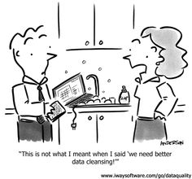
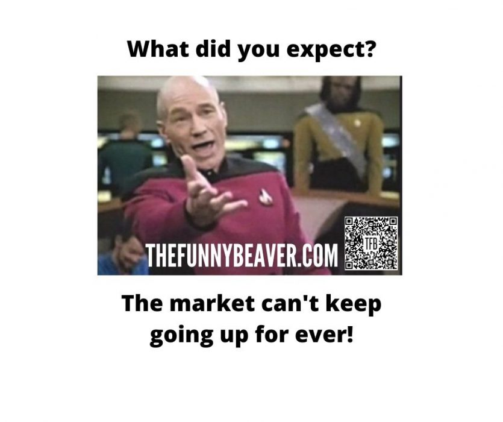
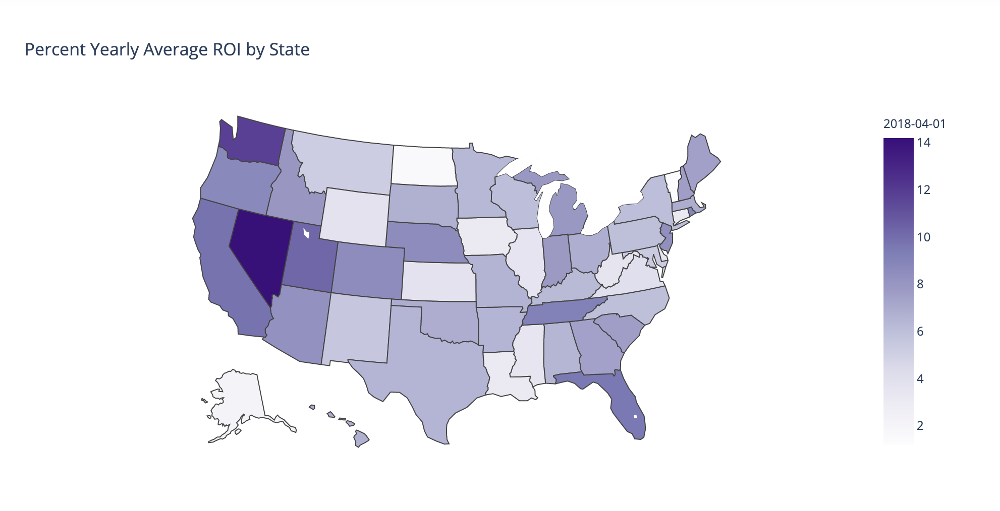

# Zillow Housing Investment Analysis

An analysis project by: Leighanna Hooper

**The data analysis and modeling can be located within my attached notebooks in this repository.  
They have been labeled and organized for your reading pleasure!

### Table of Contents:

- Motivation
- Objective
- Process
- Conclusions and Recommendations
- Future Work

Data Description:

<a href="csv/zillow_data.csv">Zillow Housing Data</a>

 

## Motivation
SUsing Zillow’s extensive range of data on home values throughout the United States, and many requirements for choosing locations, we will use time series analysis to assist in predicting the most prime investment areas for our new investment partners.

## Objective

The objective is to use time series SARIMAX model to predict which zip codes will be the best to invest in.

## Model Information

Following CRISP-DM Methodology:

We used a SARIMAX model based off our encoded engineered dataset to forecast future home values and ROI.
We used test data to validate our model.

Limitations of this model: 
Historical data of home values only.

## Our Process:

Location Choice

 
Does location have an impact?
 

We choose Chicago as our location of interest for future investments.

We filtered from 41 to 20 zip codes for possible investments – by using Zillow’s Size Rank score – it is based on population density of the zip code.  The lower the score = higher the population density. 
•	The idea/theory for this was:
•	Walkability score
•	Public transportation
•	Restaurants within x distance
•	Lower carbon emissions, etc…

Historical ROI

 
What are the best zip codes to invest in based on past return on investment?

We found that the 5 zip codes with the highest historical ROI:

- Boystown / Lakeview 60613
- West Park / West Town 60622
- Chicago Lawn 60629
- Dunning 60634
- Portage Park 60641

Forecasting Values

 
We found that the 5 zip codes 

## Conclusions and Recommendations:

If we are basing on past:

Future investments:

## Future Work:

- Look into more demographic areas 
- Break down by cities or regions in the high ROI states.

**The data analysis and modeling can be located within my attached notebooks in this repository.  
They have been labeled and organized for your reading pleasure!

<a href=""> Project Blog:  </a>

<a href="https://studio.youtube.com/channel/">Project Presentation Video</a>

<a href="">Project Presentation Slides</a>
