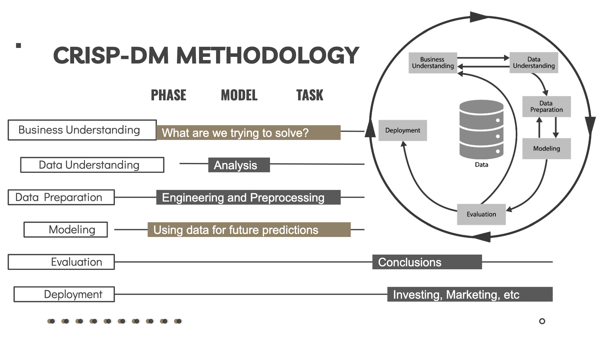
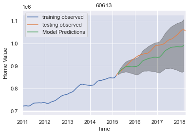
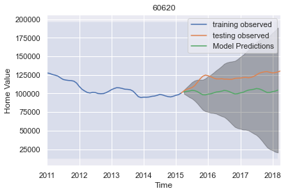
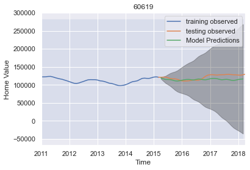
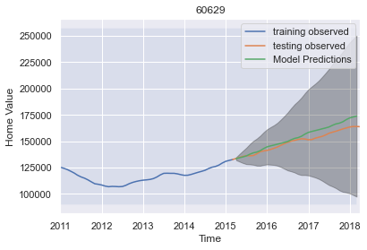
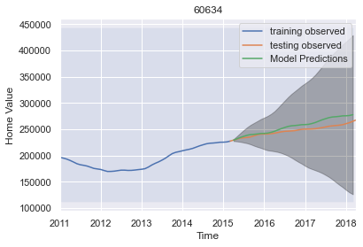
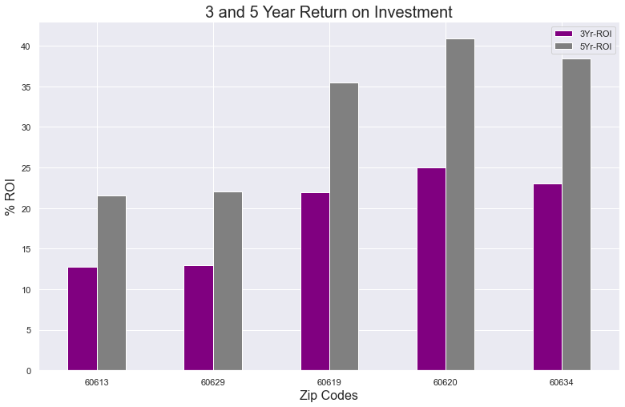

# Zillow Housing Investment Analysis

An analysis project by: Leighanna Hooper

**The data analysis and modeling can be located within my attached notebooks in this repository.  
They have been labeled and organized for your reading pleasure!

### Table of Contents:

- Motivation
- Objective
- Process
- Conclusions and Recommendations
- Future Work

Data Description:

<a href="csv/zillow_data.csv">Zillow Housing Data</a>

 

## Motivation / Objective

Predict the top 5 zip codes from Zillow’s extensive range of data on home values throughout the United States using time series analysis.

Following CRISP-DM Methodology:

## Model Information

I used a decomposable SARIMAX model based off our encoded and engineered dataset to forecast future home values and their return on investment.
I used trainng and testing data to validate our model.

## Our Process:

Zip Code Criteria

 

The dataset contained information for over 14,000 zip codes.  

In order to choose an area to explore, I used the following criteria:

- Highly urbanized locations with public transportation.
- Pedestrian friendly.
- Climate friendly. 
- Large range of restaurants and culture.
- High continous growth above national average mean.

After considering these factors, I decided to focus on Chicago.

I then filtered from 41 to 20 Chicago zip codes for possible investments by using Zillow’s size rank score. 
The size rank score is based on population density of the zip code.  The lower the score = higher the population density.  High population density = lower carbon emissions.

Modeling

 

After choosing the best parameters for all 20 zip codes, I ran the training and testing data in my SARIMAX model and then plotting them together to visualize how well my model performed.

- Boystown / Lakeview 60613

- Auburn Greshem 60620

- Chatham 60619

- Chicago Lawn 60629

- Dunning 60634

## Conclusions and Recommendations:

The top 5 zip codes to invest in are:

- Boystown / Lakeview 60613

- Auburn Greshem 60620

- Chatham 60619

- Chicago Lawn 60629

- Dunning 60634

The 3 and 5 year return on investment for all 5 can be seen below.

## Future Work:

- Bring in carbon emission data for zip code criteria selection. 
- Model with the economic crash years.
- Use neural networks to predict the top zip codes.
- Explore other locations.

**The data analysis and modeling can be located within my attached notebooks in this repository.  
They have been labeled and organized for your reading pleasure!

<a href="https://medium.com/p/45e9b88bf86b">Project Blog</a>

<a href="https://studio.youtube.com/channel/UCbEZRjM4-uR1_UIKsB_RDoQ/videos/">Project Presentation Video</a>

<a href="Zillow Home Investment Analysis.pdf">Project Presentation Slides PDF</a>
